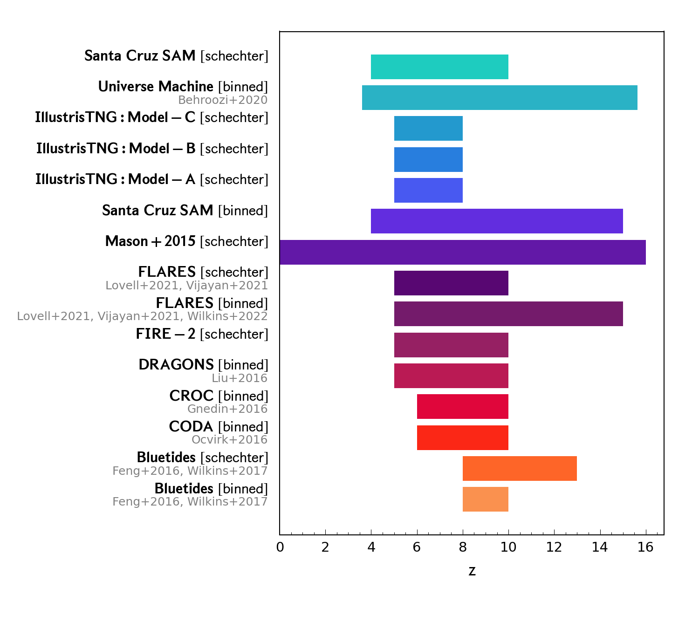
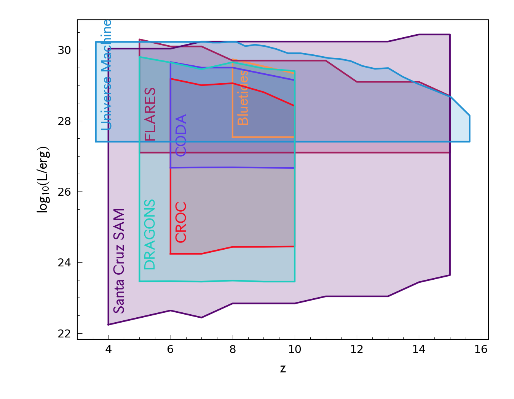
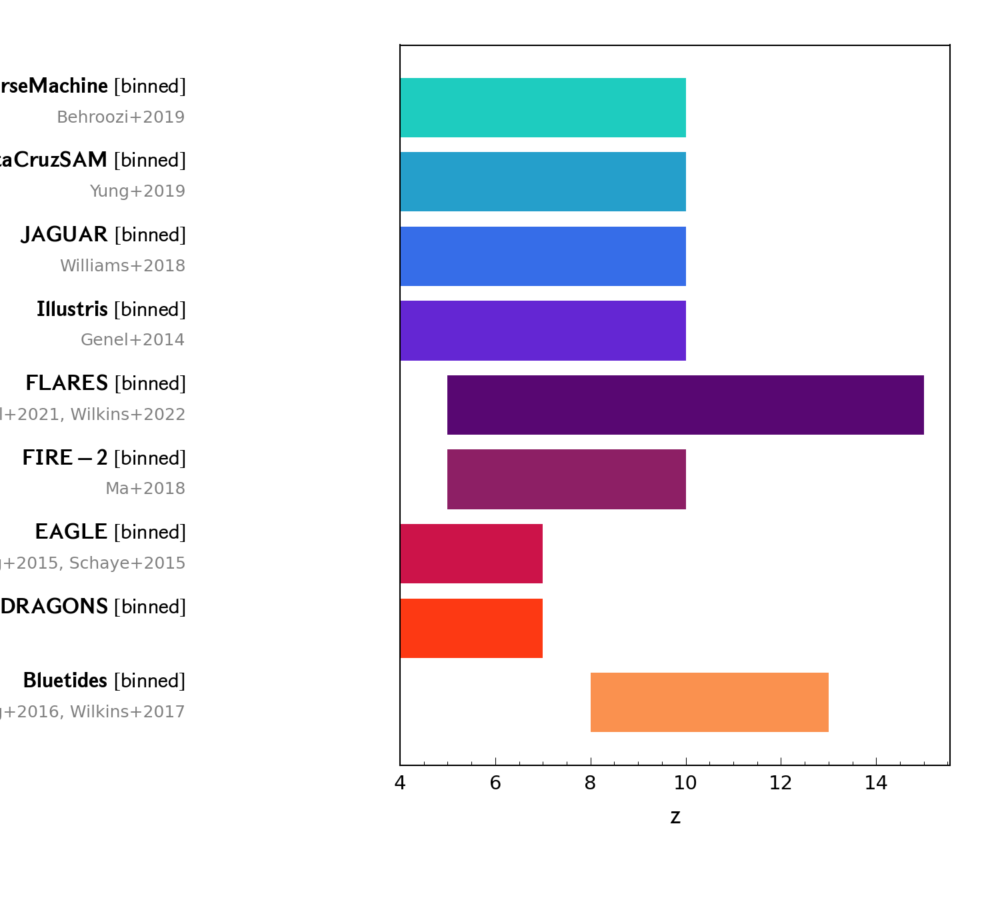
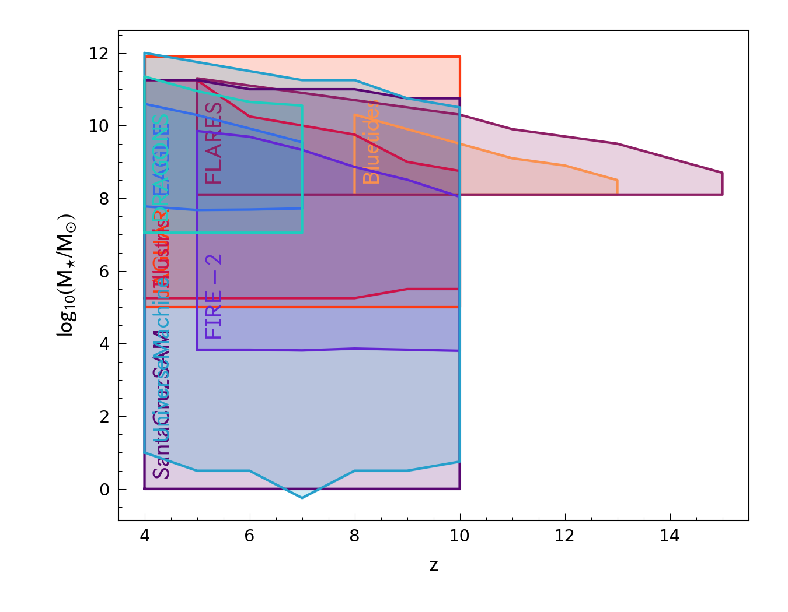
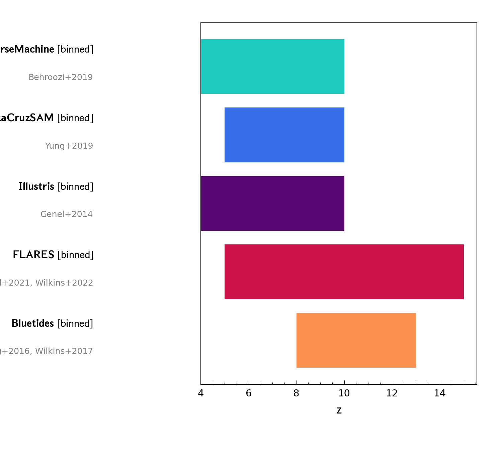
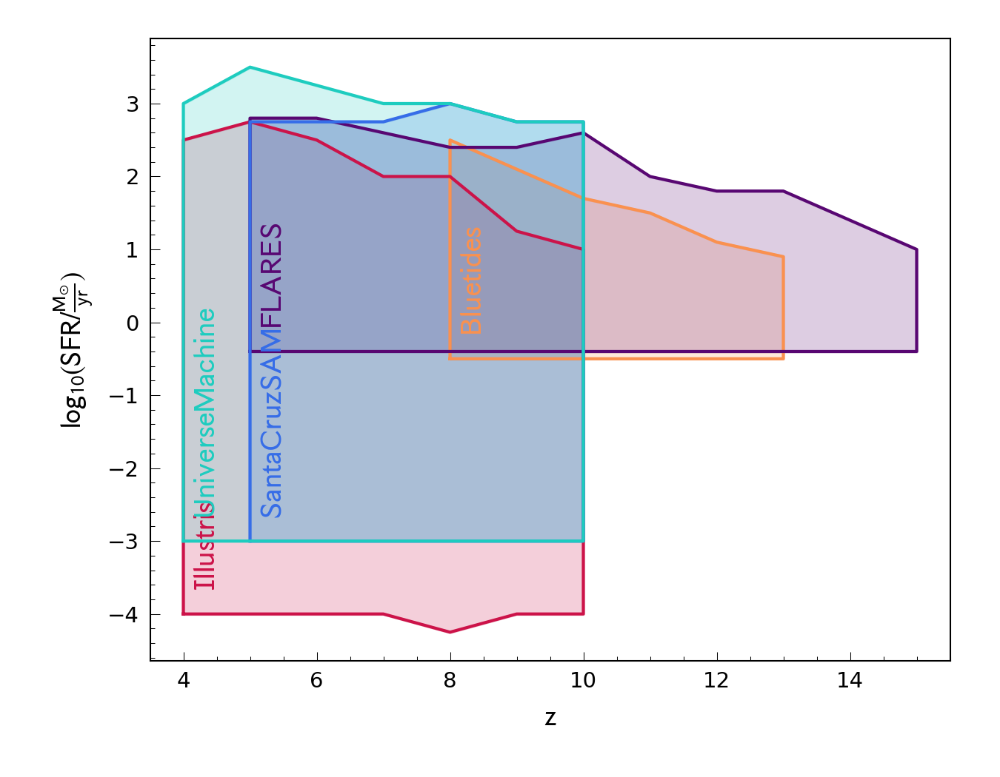

# First Light and Assembly of Galaxies (FLAGS) comparison dataset
Model predictions and observational constraints in the First Light And Reionisation Epoch

## Distribution Functions

#### UV Luminosity Function

#### Galaxy Stellar Mass Function

#### SFR Distribution Function

## Scaling Relations
