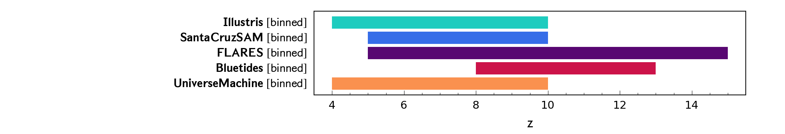
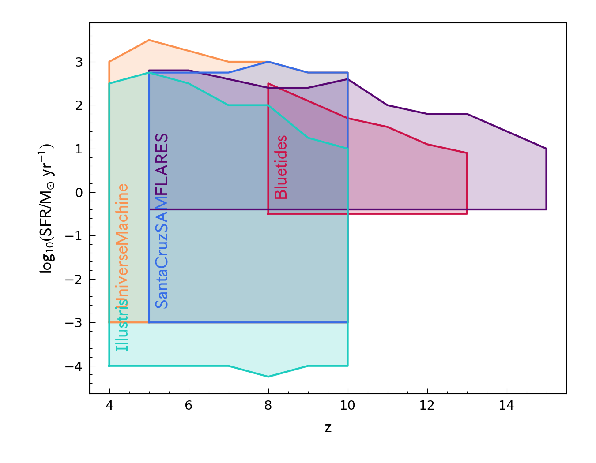
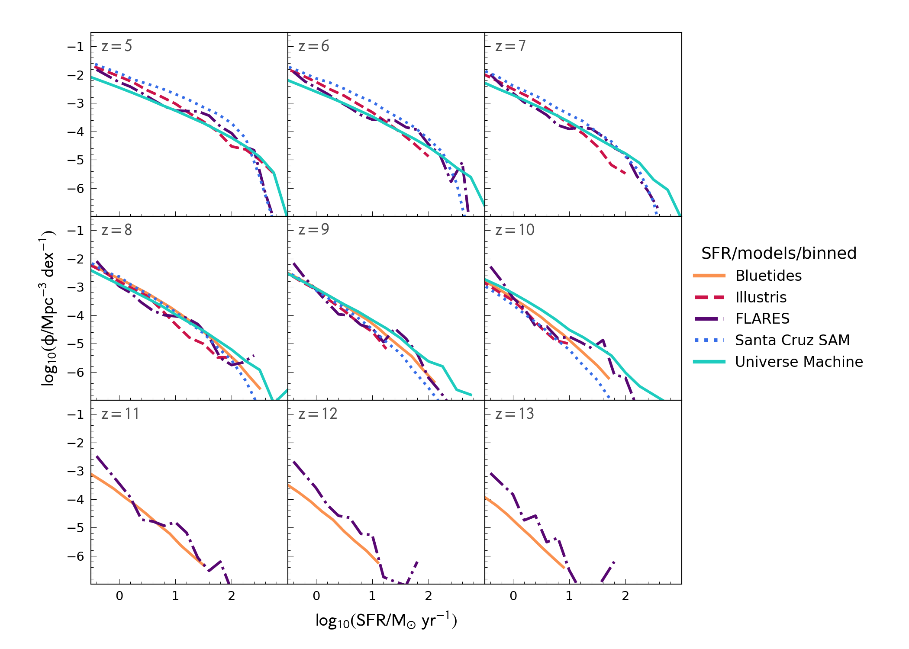

# SFR Distribution Function

| dataset name | references |
| --- | --- |
| Bluetides | [Feng+2016](https://ui.adsabs.harvard.edu/abs/2016MNRAS.455.2778F/abstract), [Wilkins+2017](https://ui.adsabs.harvard.edu/abs/2017MNRAS.469.2517W/abstract) |
| Illustris | [Genel+2014](https://ui.adsabs.harvard.edu/abs/2014MNRAS.445..175G/abstract) |
| FLARES | [Lovell+2021](https://ui.adsabs.harvard.edu/abs/2021MNRAS.500.2127L/abstract), [Wilkins+2022](https://ui.adsabs.harvard.edu/abs/2022arXiv220409431W/abstract) |
| Santa Cruz SAM | [Yung+2019](https://ui.adsabs.harvard.edu/abs/2019MNRAS.490.2855Y/abstract) |
| Universe Machine | [Behroozi+2019](https://ui.adsabs.harvard.edu/abs/2019MNRAS.488.3143B/abstract) |

